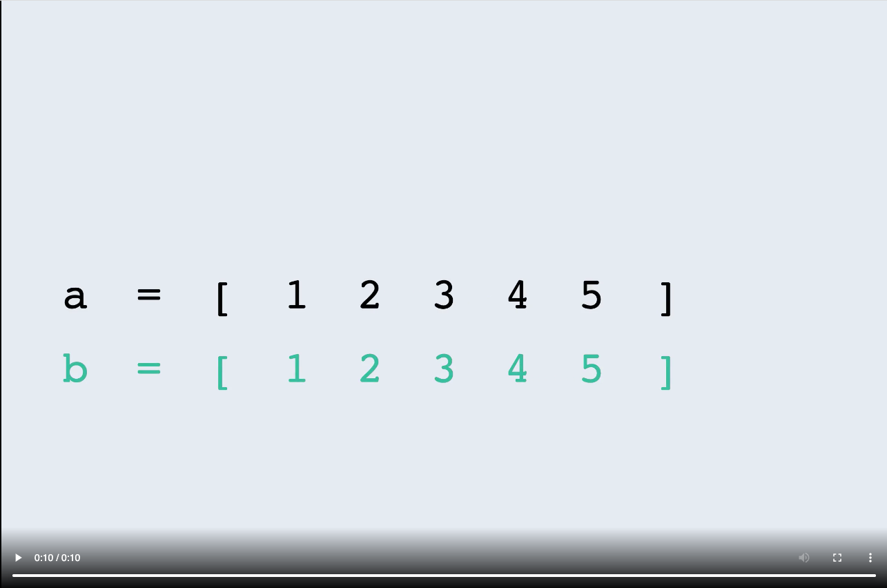

## Description
------
For two arrays `a` and `b` of the same length, let's say `a` is a cyclic shift of `b`, if it's possible for `a` to become equal to `b` by performing *cyclic shift* operations on `a` - moving 0 or more elements from the beginning of the array to the end of the array without changing the order of the elements.

You are given an array of integers `elements`. Your task is to check whether `elements` is a cyclic shift of the sorted array `[1, 2, ..., elements.length]`. Return the number of elements you need to move to make `elements` equal to the sorted array. If `elements` is not a cyclic shift of the sorted array (it's not possible to make them equal), return `-1`.

  
 Expand to see the example video. 

    

 

**Example**

-   For `elements = [1, 4, 2, 3]`, the output should be `solution(elements) = -1`.

    Let's consider all possible cyclic shifts of `elements` that could make it equal to the sorted array:

    -   Moving `0` elements from the beginning to the end, we get `[1, 4, 2, 3]`.
    -   Moving `1` elements from the beginning to the end, we get `[4, 2, 3, 1]`.
    -   Moving `2` elements from the beginning to the end, we get `[2, 3, 1, 4]`.
    -   Moving `3` elements from the beginning to the end, we get `[3, 1, 4, 2]`.
    
    None of these cyclic shifts equal the sorted array `[1, 2, 3, 4]`, so the answer is `-1`.

-   For `elements = [3, 4, 5, 1, 2]`, the output should be `solution(elements) = 3`.

    If we move the first `3` elements of the given array from the beginning to the end, we get `[1, 2, 3, 4, 5]`, which is equal to the sorted array `[1, 2, 3, 4, 5]`, so the answer is `3`.

**Input/Output**

* **[execution time limit] 4 seconds (js)**

* **[input] array.integer elements**

    An array of integers.

    *Guaranteed constraints:*

    3 ≤ elements.length ≤ 100,
    
    1 ≤ elements[i] ≤ elements.length.

* **[output] integer**

    Return the number of elements required to perform the cyclic shift on `elements` that will make it equal to the sorted array `[1, 2, ..., elements.length]`. If it's not possible to make these arrays equal after performing cyclic shift operations, return `-1`.

* **alternative/solution**    

    [Home - Bloomtech](../../code-signal-arcade-bloomtech/README.html) 
    
    [S2M1 - Task 8](../S2M1_Task_8/README.html) | [S2M1 - Task 10](../S2M1_Task_10/README.html)

**[JavaScript (ES6)] Syntax Tips**


// Prints help message to the console
// Returns a string
function helloWorld(name) {
    console.log("This prints to the console when you Run Tests");
    return "Hello, " + name;
}


## Solution
------







