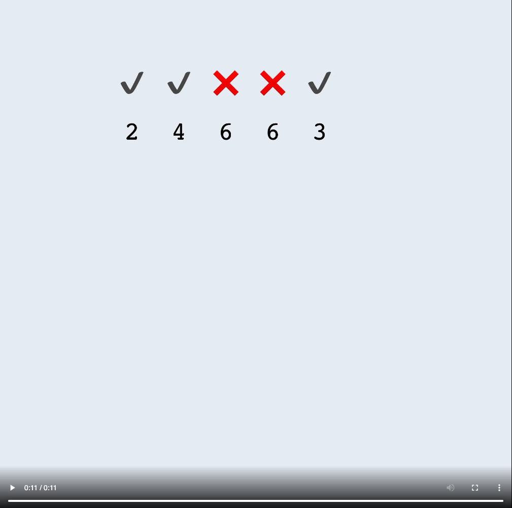
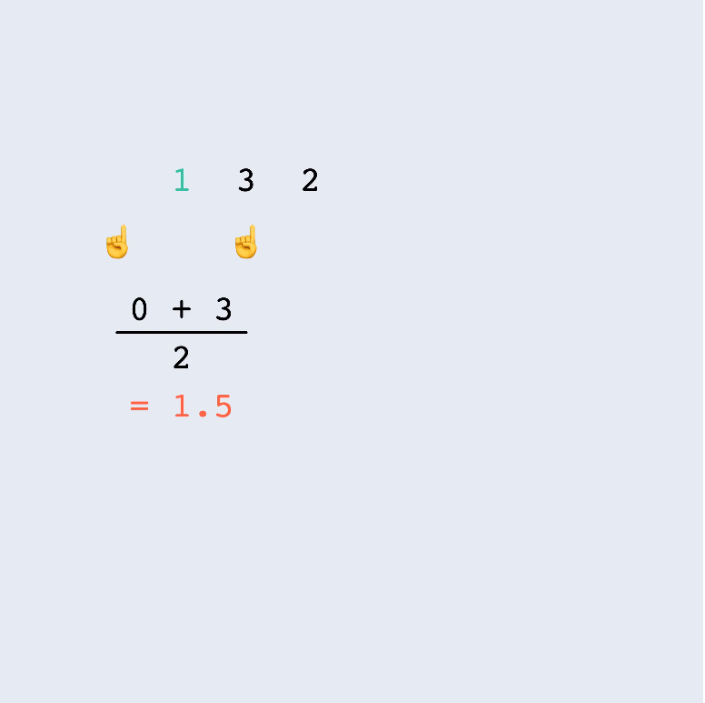

## Description
------
You are given an array of integers `a`. Your task is to calculate how many numbers in the array are equal to the `arithmetic mean` of their immediate neighbors.

In other words, count the number of indices `i` such that `a[i] = (a[i - 1] + a[i + 1]) / 2`.

**Note**: If `a[i - 1]` or `a[i + 1]` don't exist, they should be considered equal to `0`.

The arithmetic mean (also known as mean or average) of the list of values x1, x2, ..., xn, usually denoted by x̅, is the sum of these values divided by their number, i.e.` x̅ = (x1 + x2 + ... + xn) / n`.

**Example**

-   For `a = [2, 4, 6, 6, 3]`, the output should be `solution(a) = 3`.

    

 

    There are `3` elements from `a` that are equal to the arithmetic mean of their neighbors:

        -   a[0] = (0 + 4) / 2
        -   a[1] = (2 + 6) / 2
        -   a[4] = (6 + 0) / 2

    So, the answer is `3`.

-   For `a = [1, 3, 2]`, the output should be `solution(a) = 0`.

    

 

    Neither of the numbers satisfy the condition, so the answer is `0`.

* **[execution time limit] 4 seconds (js)**

* **[input] array.integer a**

    An array of integers.

    *Guaranteed constraints:*

        1 ≤ a.length ≤ 10^3,
        0 ≤ a[i] ≤ 10^6.

* **[output] integer**

    The number of elements from `a` that are equal to the arithmetic mean of their neighbors.

* **alternative/solution**    

    [Home - Bloomtech](../../code-signal-arcade-bloomtech/README.html) 
    
    [S2M4 - Task 3](../S2M4_Task_3/README.html) | [S2M4 - Task 5](../S2M4_Task_5/README.html) 

**[JavaScript (ES6)] Syntax Tips**


// Prints help message to the console
// Returns a string
function helloWorld(name) {
    console.log("This prints to the console when you Run Tests");
    return "Hello, " + name;
}


## Solution
------







